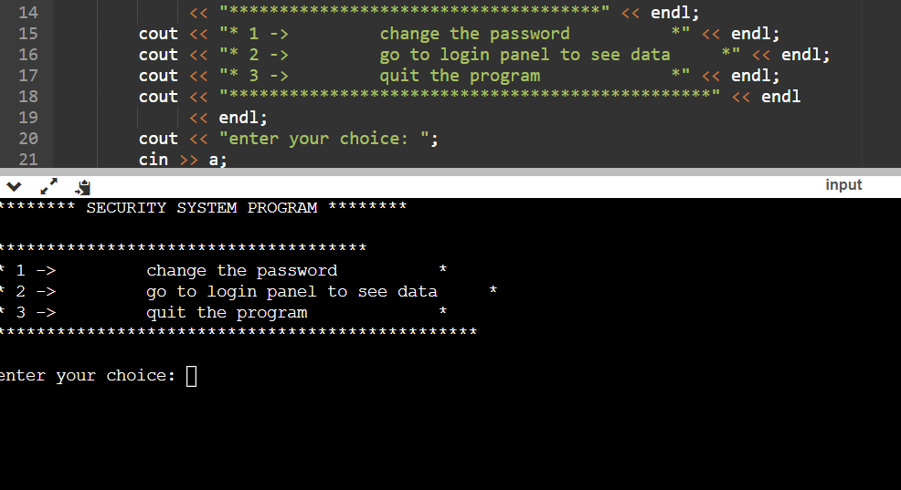
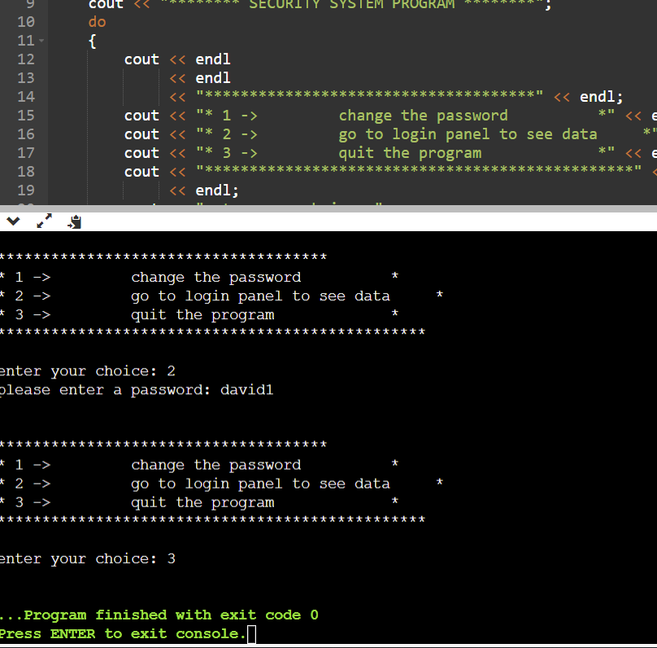

# Title: Security System 

## Coding Language: 
This is a security system project that I built using C++

## Purpose: 

## Here is a Live Demo:
https://www.youtube.com/watch?v=YY2MHgZEbME

## How to install:
1. Download from the zip: ``
2. Cd to folder named: ``
3. Make sure you have 
4. You can run the code on VS code.
5. Or use a online compiler.

## Output Screenshots:

